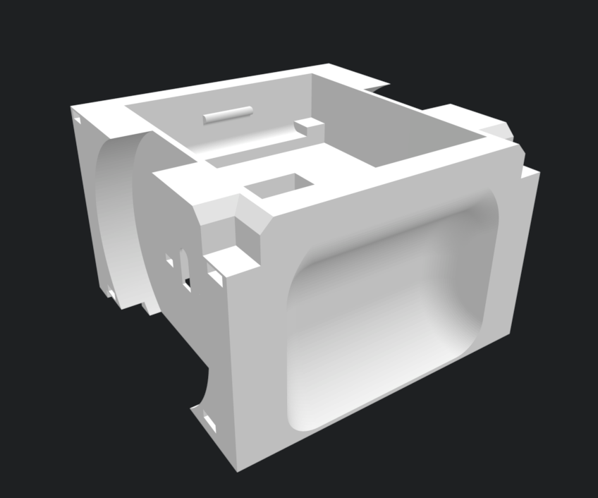
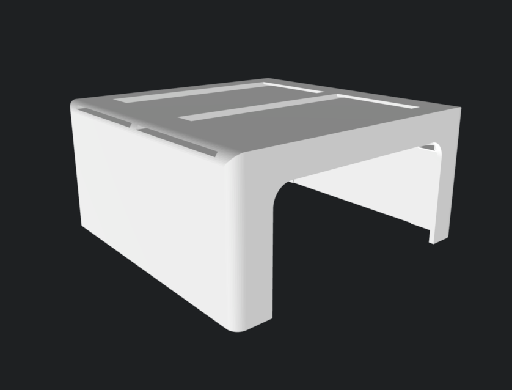
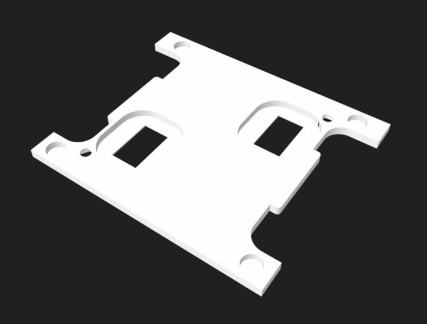

# RobôCIn VSS Robots
This Repository has the Very Small Size Robot 3D design files, bill of materials, printing settings and assembly instructions.

[Content available on Wiki!](https://github.com/robocin/vss-mechanics/wiki)

### VSS Robots Projects:
-  [2018 Robot](https://github.com/robocin/vss-mechanics/wiki/VSS-Robot-2018) (current project)

   
